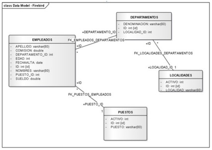

## Dada la siguiente base de datos relacional: RESUELVA LAS SIGUIENTES CONSULTAS EN SQL:





a)	Mostrar los nombres de los empleados ordenados alfabéticamente (Z...A) 

```
SELECT nombres FROM empleados ORDER BY nombres DESC;
```

b)	Seleccionar el nombre, el puesto y la localidad donde trabajan los empleados con puesto de ‘Soporte’.

```
SELECT nombres, puesto, localidad FROM empleados e, departamentos d, localidades l, puestos p WHERE p.puesto='Soporte' AND e.puesto_id=p.id  AND d.id=e.departamento_id  AND  d.localidad_id= l.id;
```

c)	Listar los nombres de los empleados cuyo nombre termine con la letra ‘o’.

```
SELECT nombres
FROM empleados 
WHERE nombres LIKE '%o';
```

d)	Seleccionar el nombre, el puesto y sueldo de los empleados que trabajan en la localidad Carlos Paz.

```
SELECT nombres, puesto, sueldo FROM empleados e, departamentos d, localidades l, puestos p WHERE l.localidad=’Carlos Paz’ AND e.puesto_id=p.id  AND d.id=e.departamento_id  AND  d.localidad_id= l.id;
```

e)	Seleccionar el nombre, sueldo y localidad donde trabajan de los empleados que tengan un sueldo entre 10000 y 13000.

```
SELECT nombres, sueldo, localidad FROM empleados e, departamentos d, localidades l WHERE e.sueldo > 10000  AND e.sueldo < 13000 AND d.id=e.departamento_id  AND  d.localidad_id= l.id;
```

f)	Visualizar los departamentos con más de 5 empleados

```
SELECT  COUNT(departamento_id), denominacion FROM empleados e, departamentos d
WHERE e.departamento_id = d.id  GROUP BY departamento_id , denominacion
HAVING  COUNT(departamento_id)>5;
```

g)	Nombre de los empleados que trabajan en Córdoba y cuyo puesto sea ‘Analista’ o ‘Programador’.

```
SELECT nombres FROM empleados e, departamentos d, localidades l, puestos p WHERE l.localidad= ‘Córdoba’ AND p.puesto IN(‘Analista’, ‘Programador’) AND e.puesto_id=p.id  AND d.id=e.departamento_id  AND  d.localidad_id= l.id;
```

h)	Calcula el sueldo medio de todos los empleados

```
SELECT AVG(sueldo) FROM empleados  --> Este me saca el sueldo promedio de todos  los empleados 

SELECT AVG(sueldo), nombres FROM empleados GROUP BY nombres; --> Este me saca el sueldo promedio de cada empleando mostrando el nombre del mismo.
```

i)	¿Cuál es el máximo sueldo de los empleados del departamento 10?

```
SELECT MAX(sueldo) FROM empleados WHERE departamento_id = 10;
```

j)	Calcula el sueldo mínimo de los empleados del departamento ‘Soporte’

```
SELECT MIN(sueldo) FROM empleados, departamentos d WHERE d.denominacion = ‘Soporte’;
```

k)	Para cada puesto obtener la suma de sueldos.

```
SELECT SUM(sueldos), puesto FROM empleados e,  puestos p WHERE e.puesto_id = p.id GROUP BY puesto;
```